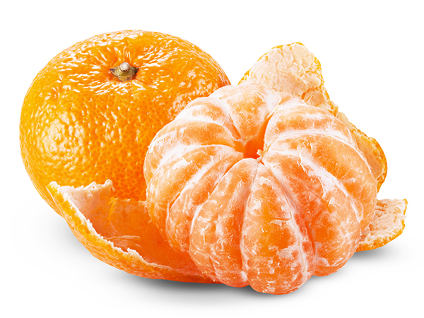

# MikanOS.rs

Developing my own operating system is a very popular hobby in Japan.
I don't know if I am telling a lie or not.
The author uses C++ in the book but I don't like it. The garbage language should be annihilated as well as Ruby and Go. Okay, how about Rust?

